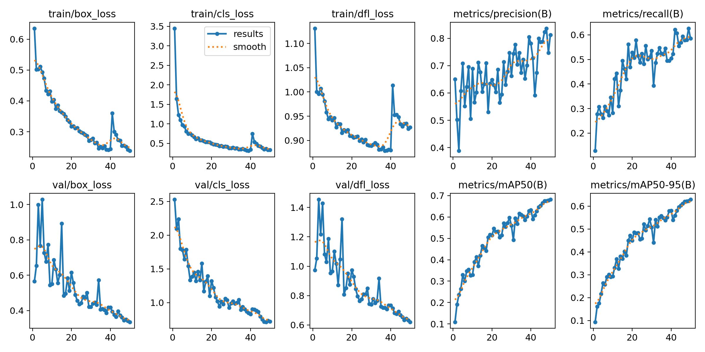
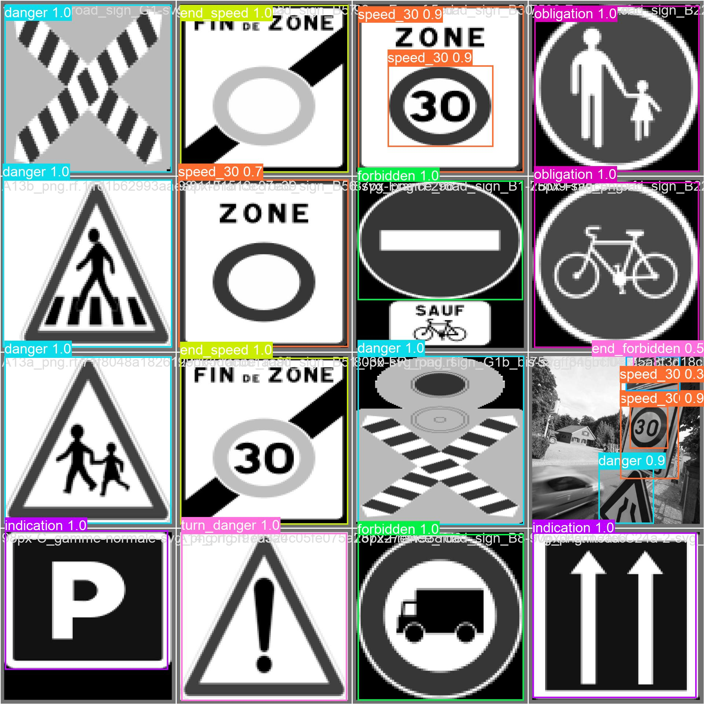
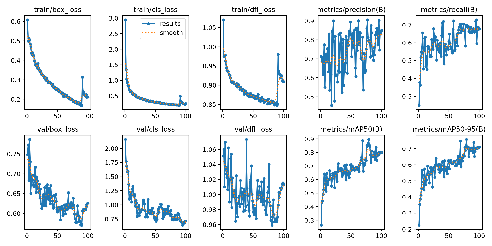
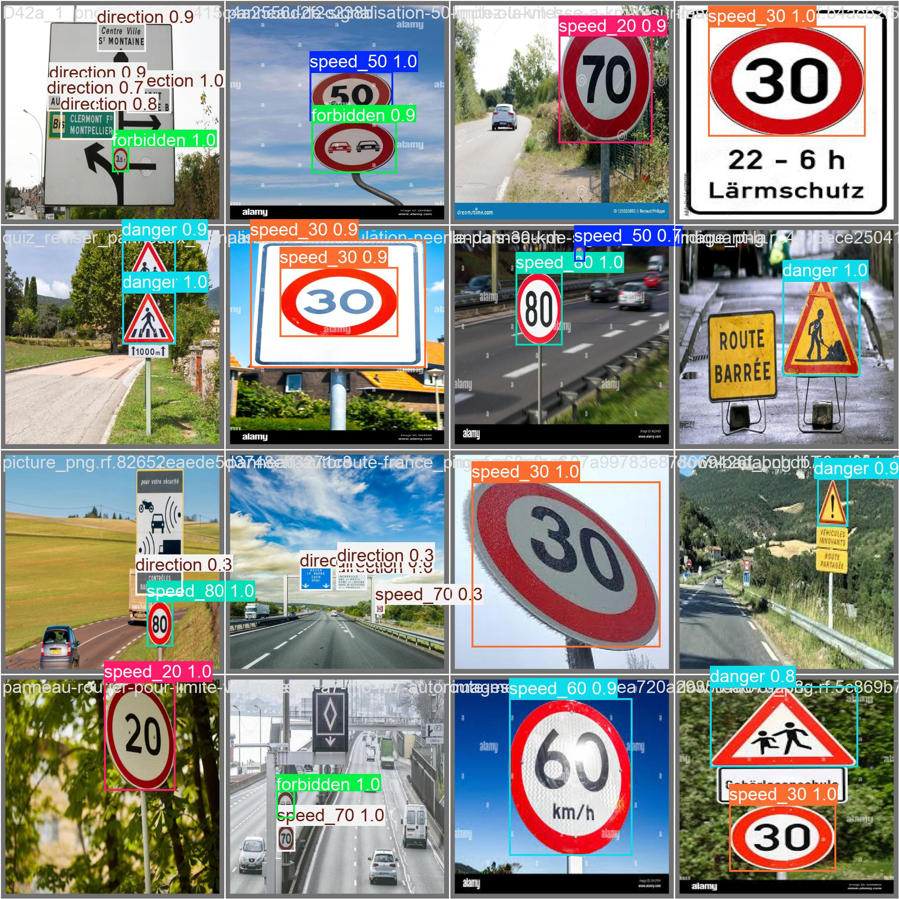
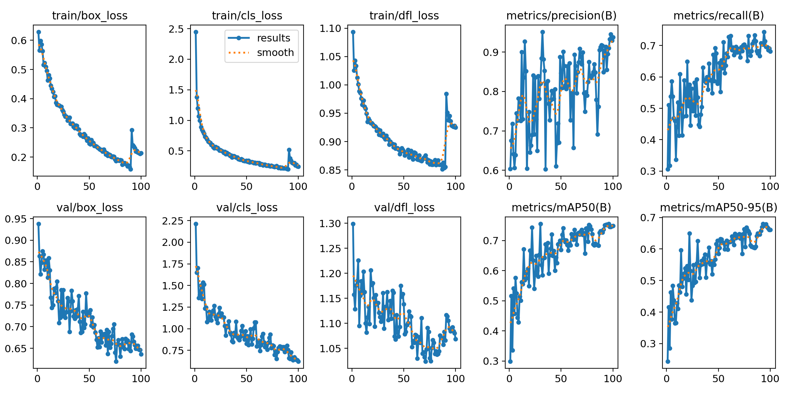
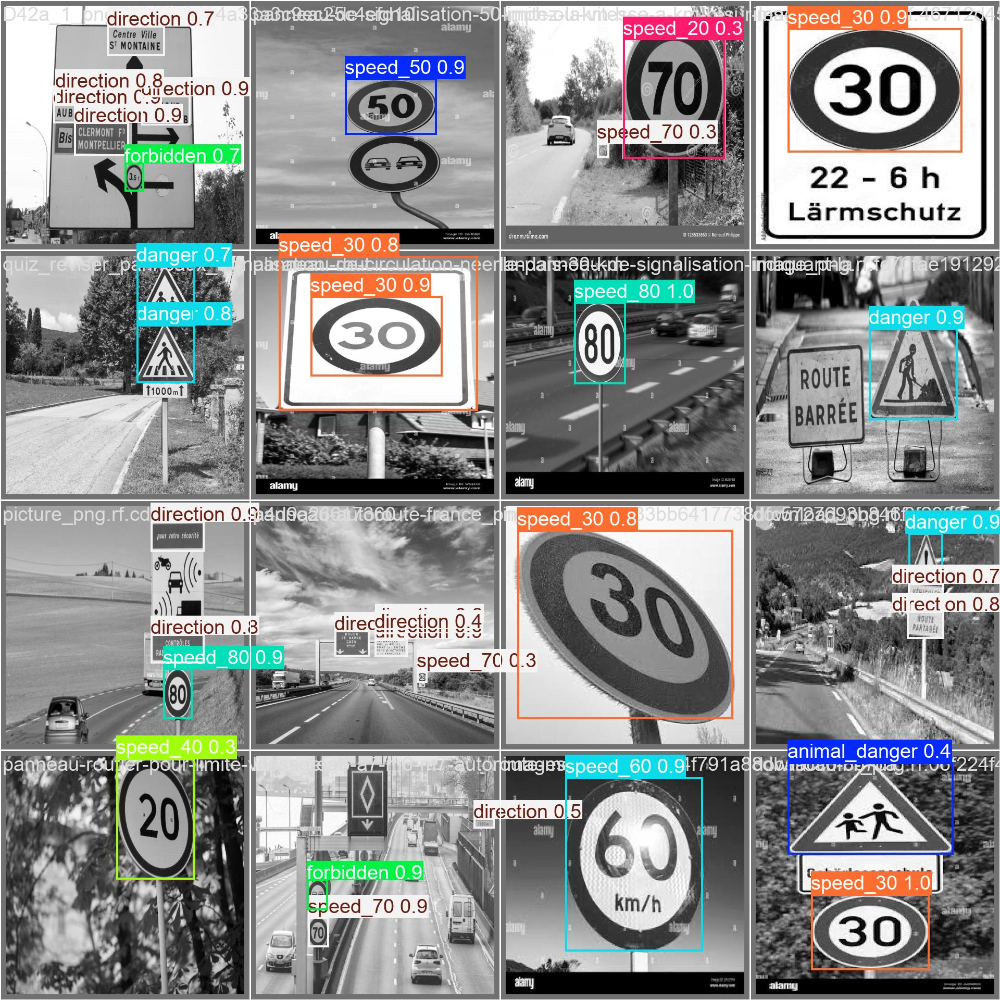

# 👀🚗 YOLOroad - Training small models on signs

This project aims to train a vision model on images of french traffic/road signs, to get a fine-tuned model capable of multiple signs recognition, particularly for the speed of the classification of a sign (information, danger or something forbidden).

One goal would be to have a lightweight, efficient yet powerful vision model to integrate into an embedded system like car or RC Car. It could then be used to create a semi-autonomous systems capable of adapting the vehicle's behavior to the rules on the road.

YOLO models have a good latency and accuracy than their previous models, and are lightweight to run, giving options to run very small and less capable vision models. Their documentation and support around the web is quite dense.

## 🔧 Setup

--> Go to [the setup instructions file !](setup.md "setup instructions file")

## 📈 Performance metrics

[The original dataset](https://universe.roboflow.com/image-understanding/panneaux-v2https://universe.roboflow.com/image-understanding/panneaux-v2 "Link to the dataset !") was made by scraping online images from google images or other sources. The images may be protected by copyright. The labeling process was made on [Roboflow](https://universe.roboflow.com/image-understanding/panneaux-v2 "Dataset Labeled"), and dispatched on a basis : 97% train set / 3% valid set / 1% test. The valid test could be higher but since there wasn't many images, the decision has been taken to emphasize the accuracy of the training part.

YOLO11 models for detection comes in multiple models :

| Model                                                                             | size ` `(pixels) | mAP ``val ` `50-95 | Speed ` `CPU ONNX ` `(ms) | Speed ` `T4 TensorRT10 ` `(ms) | params ` `(M) | FLOPs ` `(B) |
| --------------------------------------------------------------------------------- | -------------------------- | ------------------------------ | ---------------------------------------- | --------------------------------------------- | ----------------------- | ---------------------- |
| [YOLO11n](https://github.com/ultralytics/assets/releases/download/v8.3.0/yolo11n.pt) | 640                        | 39.5                           | 56.1 ± 0.8                              | 1.5 ± 0.0                                    | 2.6                     | 6.5                    |
| [YOLO11s](https://github.com/ultralytics/assets/releases/download/v8.3.0/yolo11s.pt) | 640                        | 47.0                           | 90.0 ± 1.2                              | 2.5 ± 0.0                                    | 9.4                     | 21.5                   |
| [YOLO11m](https://github.com/ultralytics/assets/releases/download/v8.3.0/yolo11m.pt) | 640                        | 51.5                           | 183.2 ± 2.0                             | 4.7 ± 0.1                                    | 20.1                    | 68.0                   |
| [YOLO11l](https://github.com/ultralytics/assets/releases/download/v8.3.0/yolo11l.pt) | 640                        | 53.4                           | 238.6 ± 1.4                             | 6.2 ± 0.1                                    | 25.3                    | 86.9                   |
| [YOLO11x](https://github.com/ultralytics/assets/releases/download/v8.3.0/yolo11x.pt) | 640                        | 54.7                           | 462.8 ± 6.7                             | 11.3 ± 0.2                                   | 56.9                    | 194.9                  |

Multiple tests were ran on a few lightweight models. Most of the tests were on nano, small and medium models, at 50 or 100 epochs per runs. For reference, the training ran on a RTX 3050Ti Laptop GPU, and the longest training took 6 hours on the medium model on 100 epochs. Going with models like large or x would have too much parameters for my GPU to handle, despite having a greater accuracy.

* first ran tests on the nano model, which is the most lightweight but has only 2.6M parameters, and thus making a lot of errors after the training.
* then went on the small model, which provided greater accuracy while still making a good amount of errors in the recognition.
* tried to run the medium model on 100 epochs, but it took a huge amount of time. However, having 20.1M parameters hugely improved the accuracy.

The choice has been made to make the dataset in 2 versions, one original and one grayscaled version. The detection on a a grayscale basis has a greater accuracy on the color one since the model doesn't have to deal with 3 RGB channels, hence improving the detection of forms, like specific logos on signs or numbers.

Here is some performance comparisons based on the runs :

#### YOLO11 small model, 100 epochs - grayscale dataset

<figure style="align: center;">
  
Global metrics

  
</figure>

<figure style="align: center;">
  
Predictions on validation data

  
</figure>

#### YOLO11 small model, 100 epochs - color dataset

<figure style="align: center;">
  
Global metrics

  
</figure>

<figure style="align: center;">
  
Predictions on validation data

  
</figure>

If we compare the 2 results curves, we can see that the color dataset has fuzzier precision and recall metrics curve, which could be a sign that the grayscale dataset produces more accurate results along the training, and could be more precise on a fine-tuned model.

Furthermore, here is the results produced by the medium model :

#### YOLO11 medium model, 100 epochs - grayscale dataset

<figure style="align: center;">
  
Global metrics

  
</figure>

<figure style="align: center;">
  
Predictions on validation data

  
</figure>

The medium model later revealed to be far more accurate on test scripts ran with the fine-tuned model on a wide range of images.

For example, this is some results that could be tested on the medium model :

Whereas this is some flaws that could be seen while testing the on the small model :

## Future work

The main improvement that could be made to this project would be :

Enhance the quality of the dataset

* More images, current ~1200 images, best would be at least 5000 or 10000
* Less classes, some being irrelevant, or more images per classes, since there is classes with too few images in them for reference :

<figure style="align: center;">
  
</figure>

Train on better GPUs and better vision models, for a larger span of time, like yolo11l or yolo11x

* More parameters, and more training time, hence more accuracy on the detection

# 🤗 Contributing

Any help or contribution is appreciated, whether it's some better datasets, code or any sort of improvements to the project, feel free to fork this repo, add your changes and open a PR, I'll gladly review it !

# 🗒️ References

> Ultralytics YOLO11 [Github](https://github.com/ultralytics/ultralytics.) / Roboflow [Website](https://roboflow.com/ "Roboflow website") / Pytorch [Website](https://pytorch.org/ "Pytorch website") / CUDA [Website](https://developer.nvidia.com/cuda-zone "CUDA ZONE")

---
